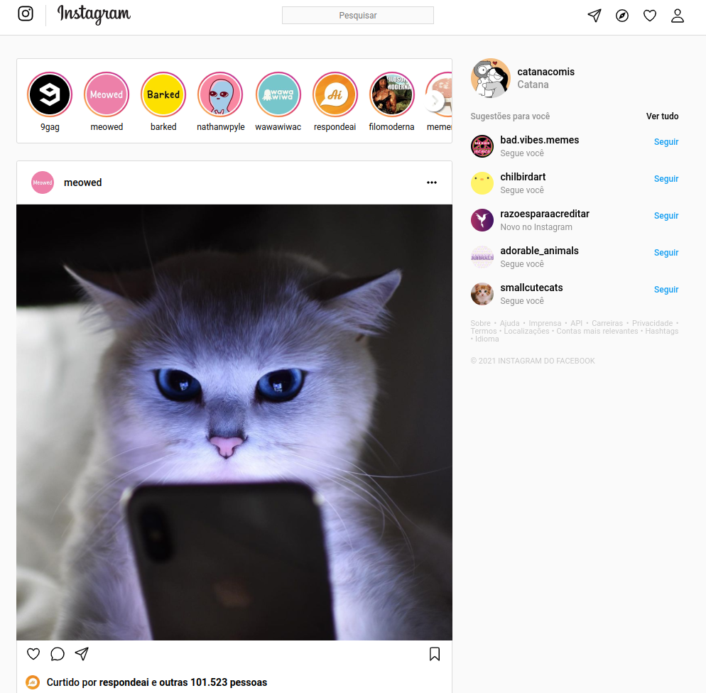

  

 
  
- Criação da página principal do Instagram de forma estática.
   
- Responsividade para todos os tamanhos de telas

# Tópicos explorados

- Flex-box
- Media Query
- Responsividade
- Positions
- Ion-icons
- Html video

# Tecnologias 
- 
- 
- 
- 

# Preview

  
   
   
  
Clique na imagem para acessar a página

 
